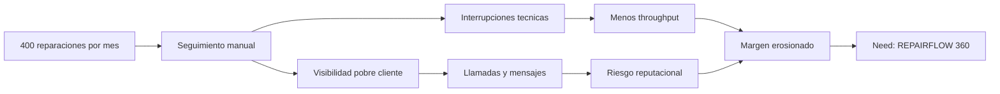
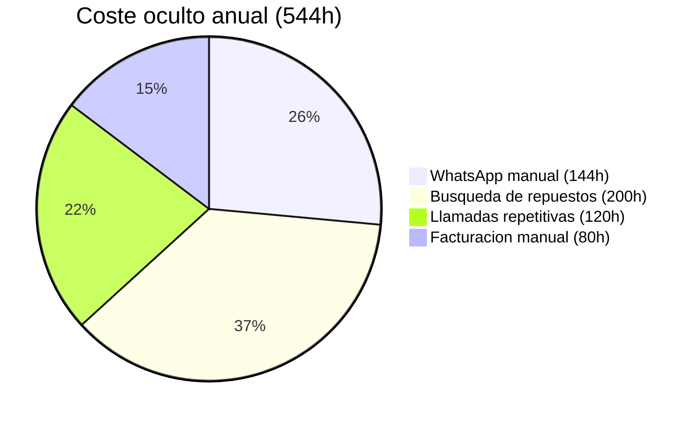
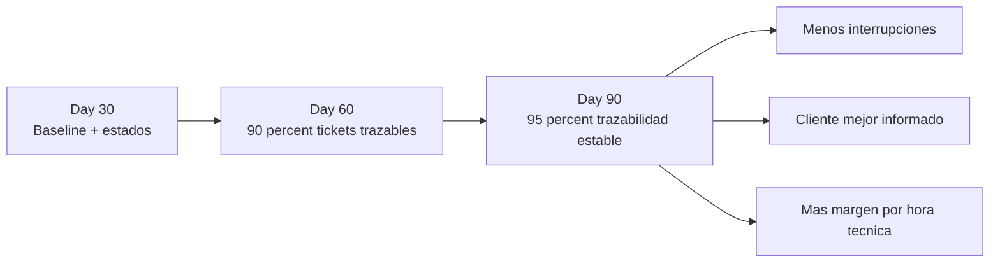
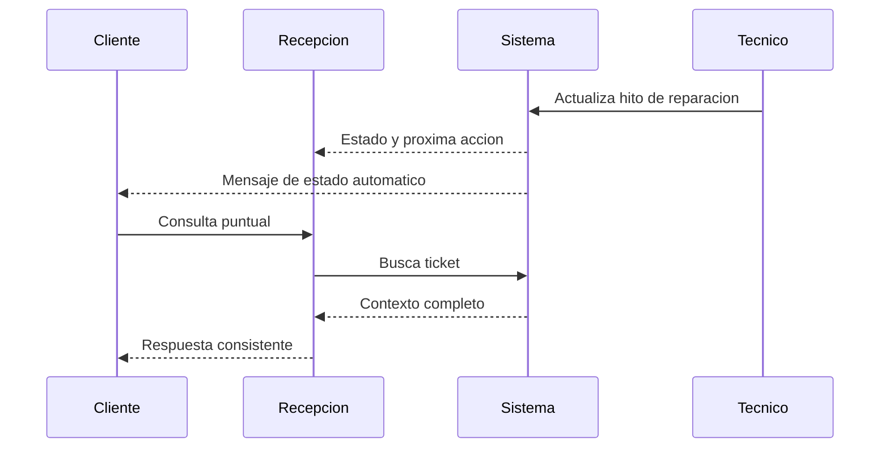
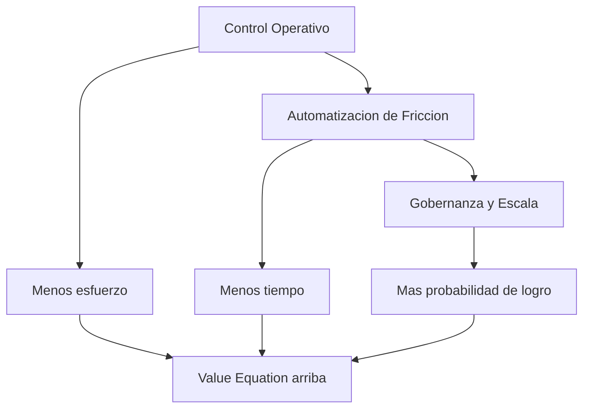
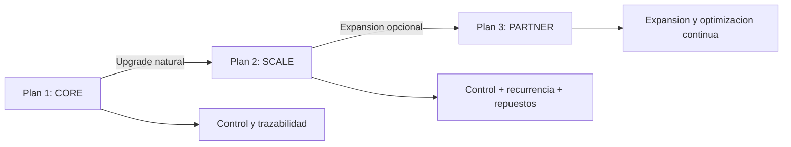

# Offer Design Document v2 — DVD Consolas (IA360)
<!-- SOURCE: Deals/IA360_DVD_Consolas/00.-Client_Context/00.- Context_Client_Document.md -->

## Document Purpose
This document designs the complete offer using Hormozi's Value Equation (Dream Outcome, Likelihood, Time & Effort). The Offer Document translates Context insights into a structured, high-value proposition with clear plans, guarantees, and transformation narrative.

---

## 🚀 OFFER — REPAIRFLOW 360™

**De taller reactivo con memoria distribuida y fricción invisible -> Taller con control operativo, trazabilidad y crecimiento rentable sin perder trato humano.**

### Briefing de Equipo (modo Hormozi)

Equipo, esto es lo importante:
- El cuello de botella no es talento técnico. Es fricción operativa.
- 400 reparaciones/mes con sistema artesanal siempre acaba igual: más ruido, más errores, menos margen.
- Nuestro trabajo no es "automatizar por automatizar". Es instalar control que escale.

---

## 00. ONE SENTENCE PITCH -> Elevator Pitch (Hormozi-style)

**Version aspiracional (vision):**

"En 90 dias, DVD Consolas pasa de depender de WhatsApp manual y seguimiento artesanal a operar con un sistema unificado de estados, comunicacion por hitos y recurrencia postservicio. Resultado: menos interrupciones, mas foco tecnico y una experiencia de cliente consistente que protege reputacion y margen. Convertimos volumen en ventaja operativa en lugar de caos acumulado."

---

## 0. NOMBRE DEL PROYECTO / IDEA INICIAL

| Campo | Definicion |
|-------|------------|
| **Nombre del sistema** | REPAIRFLOW 360™ |
| **Subtitulo** | Sistema operativo para control de reparaciones, comunicacion de estado y recurrencia de mantenimiento |
| **Primer departamento** | Recepcion + Seguimiento de tickets + Atencion de estado |
| **Tipo de proyecto** | Infraestructura operativa de servicio tecnico (no herramienta aislada) |
| **Rol de la IA** | Copiloto operativo: clasifica, propone y automatiza friccion; el equipo tecnico conserva decision final |
| **Vision a largo plazo** | Fase 1: control y trazabilidad; Fase 2: inteligencia de repuestos; Fase 3: expansion comercial por recurrencia |

---

## 1. AVATAR DIA 1 — Situacion actual

| **Aspecto** | **Descripcion** |
|-------------|------------------|
| **Quien es hoy el cliente?** | - Taller especializado en PlayStation, Xbox, PC y moviles - Volumen alto: 100 reparaciones/semana con 4 tecnicos - Usa Divergest para registro/facturacion, pero el seguimiento real ocurre fuera del sistema - Comunicacion repartida en varios numeros y conversaciones sin memoria central |
| **Que siente?** | - Interrupcion constante del trabajo tecnico por seguimiento manual - Frustracion por tener que reconstruir contexto antes de responder - Riesgo reputacional cuando el cliente no entiende estado ni tiempos - Sensacion de que el negocio crece en carga, no en control |
| **Que intenta?** | - Responder bajo demanda por WhatsApp cuando el cliente pregunta - Resolver llamadas repetitivas de informacion basica y estado - Mantener el ritmo del taller con esfuerzo humano adicional |
| **Que le duele de verdad?** | - **544 horas al ano** consumidas por friccion operativa - **3h por semana** en mensajes manuales de estado (con coste de interrupcion) - **8-10 llamadas diarias** repetitivas - **Riesgo de acumulacion silenciosa** de equipos por falta de aviso y trazabilidad |

### Visual de coste oculto

---

## 2. OBSTACULOS PRINCIPALES

**Sistema de seguimiento fuera del sistema principal** — El ERP registra, pero la operacion de estado y comunicacion se ejecuta por canales sueltos.

**Memoria operativa distribuida entre personas y chats** — La continuidad depende de quien atendio antes, no de un historial unico por ticket.

**Comunicacion reactiva en lugar de proactiva por hitos** — Se informa cuando el cliente pregunta, no cuando el proceso avanza.

**Proceso de repuestos no estandarizado** — Busquedas repetitivas manuales que drenan tiempo tecnico y velocidad de respuesta.

**Recurrencia comercial no activada** — Mantenimiento recomendado sin motor de recordatorios ni ciclo postservicio.

**Escalado sin gobernanza** — Con 400 reparaciones/mes, el modelo actual aumenta friccion y riesgo en vez de aumentar throughput.

---

## 3. DREAM OUTCOME — Avatar Dia 90 (Transformacion)

### Resultado final claro

DVD Consolas opera con un **Repair Operations System** que:
- Estandariza estados de reparacion y criterios de transicion.
- Garantiza trazabilidad por ticket con ultima actualizacion y proxima accion.
- Automatiza comunicacion en hitos clave sin perder revision humana.
- Reduce interrupciones de tecnico y libera horas de valor.
- Activa recurrencia de mantenimiento con campanas periodicas.

Todo **sin prometer automatizacion ciega ni sustituir criterio tecnico**.

### Como se siente ese estado?

- En control diario, con menos ruido operativo.
- Con confianza al responder porque el contexto esta centralizado.
- Con foco tecnico mas estable durante la jornada.
- Con tranquilidad para crecer sin deteriorar experiencia del cliente.

### Que cambia en el dia a dia?

- Cada ticket tiene estado, responsable y proxima accion visibles.
- El cliente recibe actualizaciones por evento relevante, no por insistencia.
- El equipo usa respuestas estandar para preguntas repetitivas.
- La busqueda de repuestos sigue un flujo definido, no improvisado.
- El taller ejecuta recordatorios de mantenimiento de forma periodica.

### Metrica observable (Day 30 / Day 60 / Day 90)

- **Day 30:** baseline operativo cerrado + flujo de estados desplegado.
- **Day 60:** >= 90% de tickets activos con estado y proxima accion actualizados.
- **Day 90:** >= 95% de tickets activos con trazabilidad completa.
- Mensajeria manual de estado: de 3h/semana a <= 60 min/semana.
- Llamadas repetitivas: reduccion objetivo >= 40% frente a baseline.
- Recurrencia: 1 ciclo mensual de recordatorios en produccion con reporte.

---

## 4. TABLA RESUMEN — Problema -> Solucion

| PROBLEMA REAL | COMO LO SOLUCIONA LA OFFER |
|---------------|----------------------------|
| Seguimiento manual e interruptivo | Sistema de estado por ticket + reglas de transicion + automatizacion por hitos |
| Cliente sin visibilidad de reparacion | Mensajeria proactiva de estado con trazabilidad de ultima actualizacion |
| Contexto repartido en multi-WhatsApp | Historial operativo central por cliente/equipo/ticket |
| Busqueda de repuestos lenta | Flujo estructurado de comparacion de proveedores y registro de decision |
| Recurrencia no explotada | Motor mensual de recordatorios de mantenimiento por segmentos |
| Exceso de preguntas repetitivas | Playbook FAQ + plantillas de respuesta para recepcion/atencion |

### Flujo operativo objetivo

---

## 5. STACK INTELIGENTE DE LA OFFER

### Capa 1 — CONTROL OPERATIVO™ (Foundation)

- Flujo de estados y criterios de transicion por ticket.
- Campos minimos obligatorios: estado, responsable, proxima accion, fecha.
- Historial unico de interacciones por cliente/equipo.
- Tablero operativo basico de seguimiento diario.

👉 **Value Equation impact:** reduce **Effort and Sacrifice** y **Time Delay**.

### Capa 2 — AUTOMATIZACION DE FRICCION™ (Intelligence)

- Disparadores de comunicacion en hitos criticos.
- Plantillas de mensaje por estado y excepcion.
- Playbook FAQ para llamadas/mensajes repetitivos.
- Flujo guiado de comparacion de repuestos.
- Recordatorios periodicos de mantenimiento.

👉 **Value Equation impact:** aumenta **Perceived Likelihood** y reduce **Time Delay**.

### Capa 3 — GOBERNANZA Y ESCALA™ (Control)

- Human-in-the-loop en excepciones operativas.
- Reglas de calidad (SLA de actualizacion de estado).
- Dashboard de KPIs (estado, tiempo ahorrado, recurrencia, interrupciones).
- Cadencia semanal de mejora continua.

👉 **Value Equation impact:** aumenta **Perceived Likelihood** y protege **Dream Outcome**.

---

## 6. ARQUITECTURA DE LA OFFER (Planes)

### 🔵 PLAN 1 — REPAIRFLOW CORE™

**La infraestructura minima para recuperar control operativo en 90 dias**

#### Que ES

Implementacion fundacional de control de tickets, trazabilidad y comunicacion operativa para eliminar dependencia de memoria distribuida.

#### Que hace

- Disena e implanta flujo de estados y criterios de transicion.
- Implementa registro central de contexto por ticket.
- Activa plantillas de comunicacion de estado (hitos principales).
- Despliega playbook FAQ de atencion.
- Forma al equipo en rutina de uso y actualizacion.

#### Entregables y duracion

- Duracion estimada: 6 semanas de implementacion + 2 semanas de estabilizacion.
- 1 mapa operativo de estados validado.
- 1 set de plantillas de comunicacion (minimo 8).
- 1 dashboard basico de operacion.
- 1 protocolo de cierre por ticket.

#### Que habilita

- Menos interrupciones durante reparacion.
- Menor incertidumbre del cliente.
- Operacion diaria mas predecible con el mismo equipo.

---

### 🟢 PLAN 2 — REPAIRFLOW SCALE™

**Incluye TODO REPAIRFLOW CORE™ + capa de repuestos y recurrencia comercial**

#### Que anade

- Flujo avanzado de busqueda/comparativa de repuestos con criterios de decision.
- Automatizacion ampliada para casos especiales (retrasos, espera de pieza, reprogramaciones).
- Segmentacion y motor de campanas de mantenimiento.
- Dashboard ampliado con KPIs de ahorro de tiempo y recurrencia.
- Acompanamiento de optimizacion semanal durante la estabilizacion.

#### Entregables y duracion

- Duracion estimada: 10 semanas de implementacion + 2 semanas de estabilizacion.
- 1 matriz activa de repuestos/proveedores.
- 1 sistema de recordatorios mensuales con reporte.
- 1 tablero de KPIs ampliado (operacion + crecimiento).
- 1 protocolo de revision semanal de mejoras.

#### Que NO hace (clave)

- NO sustituye al tecnico en diagnostico ni decision de reparacion.
- NO elimina contacto humano: estructura y acelera la atencion.
- NO incluye ERP a medida.
- NO controla stock ni SLA de terceros (proveedores).

👉 **Escala capacidad con control, no con mas caos.**

---

### 🔴 PLAN 3 — REPAIRFLOW PARTNER™ (Optional)

Extension trimestral de co-pilot operativo para expansion multi-sede, integracion de nuevas lineas y optimizacion continua basada en datos.

---

## 7. TOOLKIT PRACTICO (Optional)

**Incluye:**
- Libreria de plantillas por estado y excepcion.
- FAQ operativa lista para recepcion.
- Checklist de apertura/cierre por ticket.
- Matriz de comparacion de repuestos/proveedores.
- Dashboard semanal de indicadores.

---

## 8. ESCALERA Y UPGRADE

- Empiezas en **REPAIRFLOW CORE™** para resolver control y trazabilidad.
- Haces upgrade a **REPAIRFLOW SCALE™** pagando solo diferencia cuando quieras activar repuestos + recurrencia.
- Entrando directo en **REPAIRFLOW SCALE™**, reduces tiempo total de despliegue y activas crecimiento desde el inicio.

**Sin presion. Sin castigos. Escalera natural.**

---

## 9. GARANTIA

### 🔒 Garantia de Trazabilidad Operativa Day 60

**Criterios de validacion obligatorios antes del dia 60:**
- >= 90% de tickets activos con `estado + proxima accion + responsable` actualizados.
- Comunicacion de hitos criticos activa y verificable en operacion real.
- Reduccion medible del tiempo manual de seguimiento respecto a baseline inicial.

**Objetivo consolidado Day 90:**
- >= 95% de tickets activos con trazabilidad completa y rutina estable.

**Si no se cumplen los criterios Day 60 tras 14 dias de remediacion sin coste:**

👉 **Devolucion del 100% de la fee de implementacion de la fase contratada.**

**Regla de validacion:** exito = desempeno operativo medible (datos de tickets y tiempos), no percepcion subjetiva.

---

## 10. VISION A LARGO PLAZO (Narrativa estrategica)

"REPAIRFLOW 360™ no es solo orden operativo; es infraestructura de crecimiento para que DVD Consolas compita por experiencia y confianza, no por apagar fuegos mas rapido."

"Con estado trazable, comunicacion consistente y recurrencia activa, cada reparacion deja de ser una transaccion aislada y se convierte en una relacion con valor acumulado."

"A medio plazo, el negocio gana dos ventajas dificiles de copiar: disciplina operativa y memoria de cliente, base real para escalar sin sacrificar calidad."

**No se promete.** 👉 Se **habilita**.

---

## 11. FRASE DE CIERRE (Hormozi puro)

"No estas comprando automatizaciones sueltas. Estas comprando control operativo: la capacidad de reparar mas, comunicar mejor y crecer sin que el volumen rompa tu reputacion."

---

## Completion Checklist

- [x] ONE SENTENCE PITCH captures transformation, not features.
- [x] AVATAR DAY 1 connects directly to Context Document insights.
- [x] DREAM OUTCOME is specific to Day 90 timeframe.
- [x] OBSTACULOS map to Context Document problems.
- [x] STACK has clear layered logic (Foundation -> Intelligence -> Control).
- [x] Each PLAN has distinct value proposition.
- [x] ESCALERA provides fair upgrade path.
- [x] GARANTIA reduces risk significantly and is deliverable.
- [x] VISION paints compelling long-term narrative.
- [x] FRASE DE CIERRE reframes the purchase strategically.
