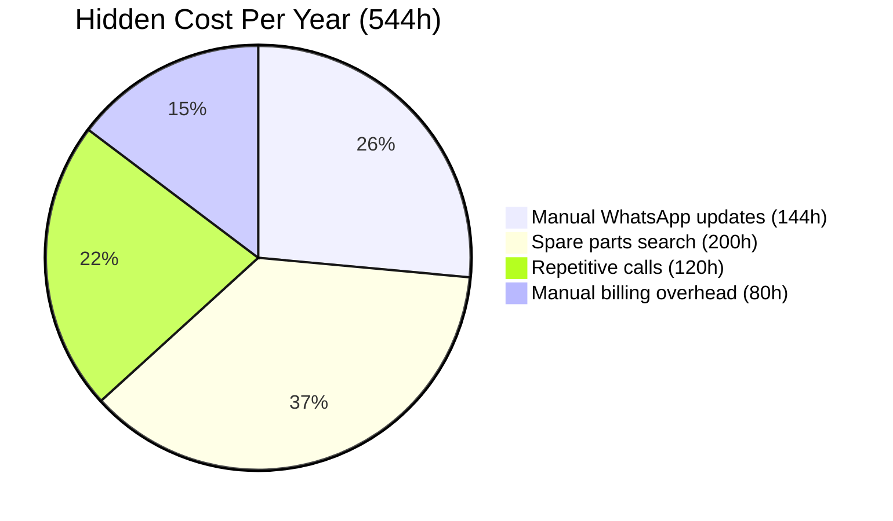
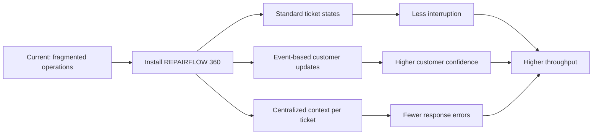
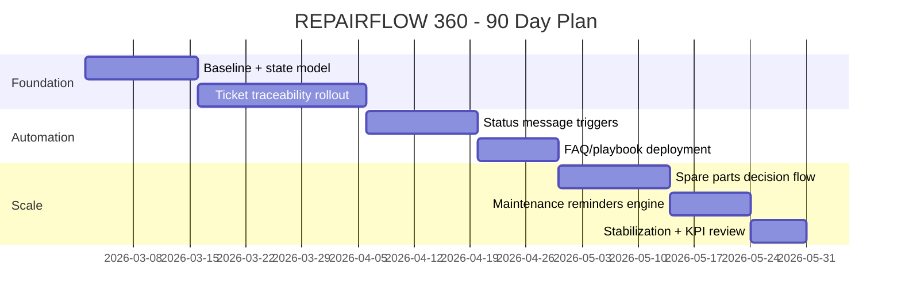

# REPAIRFLOW 360(TM) - Board View v2
<!-- SOURCE: 1.- Offer_Design_Document_v2.md -->

## Executive Snapshot

**Objective:** Turn 400 repairs/month from operational chaos into controlled throughput in 90 days.  
**Constraint:** Keep human technical judgment in control.  
**Decision needed:** Approve `CORE` or `SCALE`.

---

## 1) Why This Matters Now

- 544 hours/year lost in operational friction.
- 3 hours/week consumed by manual status messaging.
- 8-10 repetitive calls/day reduce technical focus.
- Main risk is not repair quality, it is **operational inconsistency**.

---

## 2) Strategic Thesis (Hormozi Style)

If we install one operating system for ticket status + communication + follow-up, then:
- team interruptions go down,
- customer trust goes up,
- margin per technical hour improves.

---

## 3) 90-Day Delivery Path

**Milestones**
- Day 30: baseline closed + state workflow live.
- Day 60: >= 90% active tickets with `state + owner + next action`.
- Day 90: >= 95% traceability + stable operating rhythm.

---

## 4) Offer Architecture At A Glance

| Plan | What it solves first | Duration | Key deliverables | Best for |
|---|---|---|---|---|
| **REPAIRFLOW CORE** | Control + traceability | 6 weeks + 2 stabilization | State model, ticket traceability, status templates, FAQ playbook, ops dashboard | Immediate operational control |
| **REPAIRFLOW SCALE** | Control + growth layer | 10 weeks + 2 stabilization | Everything in CORE + spare-parts decision flow + maintenance reminder engine + expanded KPI board | Control + recurring revenue activation |

---

## 5) Risk Reversal (Guarantee)

**Day-60 Objective Criteria**
- >= 90% active tickets updated with `state + next action + owner`.
- Critical status communications live and verifiable.
- Measurable reduction in manual follow-up time vs baseline.

**If not met after 14-day remediation window:**  
`100% implementation fee refund` for contracted phase.

---

## 6) KPIs The Team Will Track Weekly

- Active tickets with full traceability (%)
- Manual status messaging time (hours/week)
- Repetitive calls/day
- Average response consistency score
- Reminder campaigns executed/month

---

## 7) Decision For This Week

1. Approve `CORE` now (fastest path to control).
2. Approve `SCALE` now (control + growth from day one).
3. Confirm kickoff date and owner side (single point of contact).

